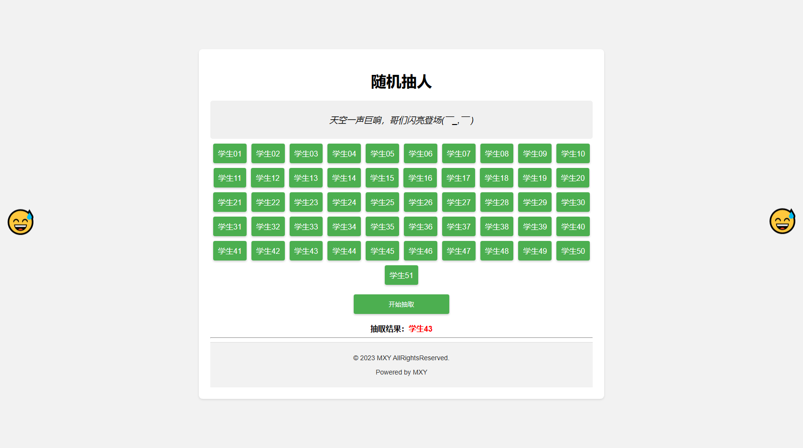

# 上课随机抽人(课堂互动工具)

## 介绍(introduction):

一个基于HTML+JavaScript+CSS的课堂互动迷你程序，用于在课堂上随机选择学生

A classroom interactive mini program based on HTML+JavaScript+CSS for randomly selecting students in class

## 使用截图(Use screenshots):

## 使用教程:

将本仓库克隆到本地或复制index.html代码即可

注意，本源码采用纯原生HTML以及JavaScript，所以没有借助其他外部资源